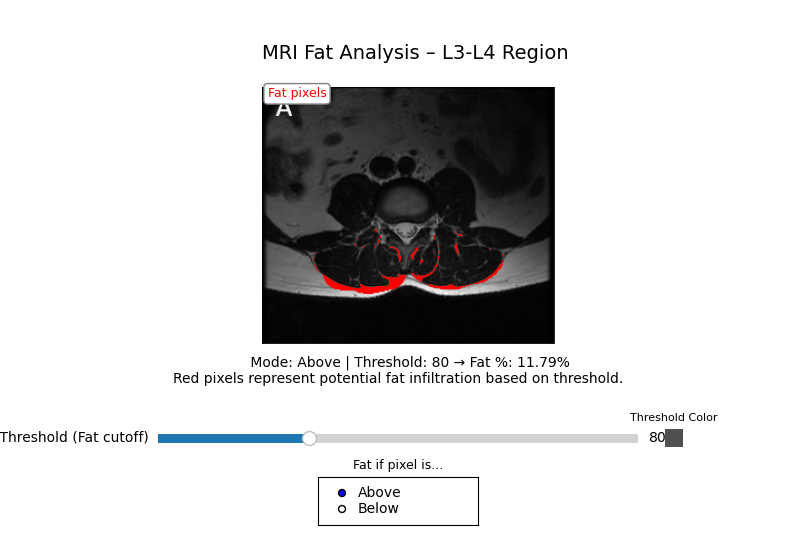

# 🧠 MRI Fat Analysis Tool

This interactive Python tool lets you analyze **muscle-to-fat ratios** from a single MRI image using a grayscale threshold approach. It highlights **potential fat pixels** in a selected region of interest (ROI) and displays an estimated fat percentage based on pixel intensity.

<p align="center">
  
</p>

---

## 🚀 Features

- 📷 **Load MRI image & ROI mask** (`.jpg` and `.png` supported)
- 🎚 **Adjust grayscale threshold** with an interactive slider
- 🔴 **Visual overlay**: Fat pixels are highlighted in red
- 🔁 **Toggle detection mode** (fat if pixel is **below** or **above** threshold)
- 📊 **Live fat percentage estimate** shown in the interface
- 🎨 Displays the actual color of the threshold level for clarity

---

## 📦 Installation

```bash
# 1. Clone the repository
git clone https://github.com/your-username/mri-fat-analysis.git
cd mri-fat-analysis

# 2. Create and activate a virtual environment (recommended)
python -m venv venv
source venv/bin/activate     # macOS/Linux
.\venv\Scripts\activate      # Windows

# 3. Install dependencies
pip install -r requirements.txt

```

Note: Python 3.8–3.11 recommended

## 🧪 How to Run
1. Add your MRI image and ROI mask to the images/ directory:
    
    * images/mri_image.jpg – the grayscale MRI image

    * images/mask.png – the binary mask image (white = ROI, black = ignore)

2. Run the app:

```bash
python analyze_gui.py
```
An interactive window will open where you can explore fat density in the selected region using the UI controls.


## 📁 Project Structure
```graphql
mri-fat-analysis/
- ├── images/
- │   ├── mri_image.png       # Your input MRI image
- │   └── mask.png            # Binary mask of ROI
- ├── analyze_gui.py          # Main interactive analysis script
- ├── README.md               # This file
- └── requirements.txt        # Required Python packages
```

## 💻 Opening the Project in VS Code

If you're using [Visual Studio Code](https://code.visualstudio.com/) (recommended), here's how to open and run the project:

### 1. Open the Folder

- Launch **VS Code**
- Go to **File → Open Folder...**
- Select the root of the cloned repository (e.g., `mri-fat-analysis/`)

### 2. Set Up the Python Environment

- Make sure you have the **Python extension** installed in VS Code.
- Open the Command Palette (`Ctrl+Shift+P` or `Cmd+Shift+P`) and search for:
`Python: Select Interpreter`
- Choose your virtual environment:
- Should look something like `.venv/bin/python` or `.\venv\Scripts\python.exe`

### 3. Install Dependencies (if not already)

In the integrated terminal (`Ctrl+`` or Terminal → New Terminal):

```bash
pip install -r requirements.txt
```

### 4. Run the Program
Open the analyze_gui.py file

Click the green ▶️ Run Python File button in the top-right

OR run it from the terminal:

```
python analyze_gui.py
```

This will launch the interactive fat analysis tool and display the MRI + UI window.


## Reference Image
The example MRI scan is one of the example images from: https://projectpillar.github.io/Scans/L1-L5%20Segmentations.html
